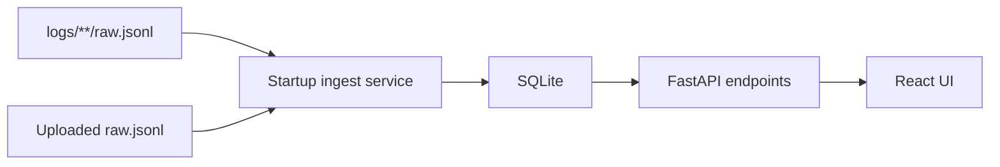

# Spread Analysis Web Design

**Date:** 2026-04-07

## Goal

Build a small Python + React web service for spread analysis and the first step toward backtesting workflows. The service should ingest `raw.jsonl` logs from `logs/**/raw.jsonl` on startup, persist chart-ready spread time series into SQLite, and let the user inspect AB and BA spread movement over time from a browser.

The first version is intentionally narrow. It only needs to show the spread trend clearly enough for an operator to see the rough shape of the opportunity and its approximate duration.

## Current state summary

- The repository already has Python spread-analysis logic in [scripts/spread_analyze.py](/Users/dddd/Documents/GitHub/cross-exchanges-arb/scripts/spread_analyze.py).
- Existing tests already cover raw log parsing and AB/BA spread computation in [tests/test_spread_analyze.py](/Users/dddd/Documents/GitHub/cross-exchanges-arb/tests/test_spread_analyze.py).
- There is no web service, no database-backed analysis layer, and no browser UI for exploring spread traces.
- `raw.jsonl` logs are the source of truth and already contain enough data to reconstruct top-of-book spread time series.

## Design principles

- Reuse the existing spread parsing logic instead of rebuilding it.
- Keep the backend thin: parse logs, persist chart-ready data, and expose simple APIs.
- Keep the first UI narrow: choose a run, upload a file, and view AB/BA lines over time.
- Store only what the UI needs for now. Do not persist full raw orderbook payloads in the database.
- Make startup ingestion resilient: one bad file should not prevent the service from starting.
- Favor a structure that can later support backtesting endpoints without redoing the ingestion layer.

## Proposed architecture

The first version should use a lightweight service split:

1. A Python backend service using FastAPI
2. A SQLite database for imported runs and spread points
3. A React frontend built as a single-page app
4. A shared Python analysis module extracted from the current script path where needed

High-level flow:

## Backend responsibilities

### Startup ingestion

When the backend starts, it should:

- scan `logs/**/raw.jsonl`
- treat each discovered file as one importable run
- parse the file into replay points using the existing spread-analysis logic
- store run metadata and spread points in SQLite
- skip reprocessing unchanged files when possible

The simplest safe deduplication rule for the first version is:

- identify runs by source path plus file fingerprint
- if the same source file was already imported and its fingerprint has not changed, skip re-import

Fingerprinting may use file size plus mtime for the first version. A content hash is acceptable if the implementation remains simple.

### Upload ingestion

The backend should also accept a user-uploaded `raw.jsonl` file from the browser. Uploaded files should follow the same parsing and persistence flow as startup ingestion. After upload completes, the new run should be queryable immediately from the same API surface as startup-imported runs.

### Query API

The backend only needs a small API surface in the first version:

- `GET /api/runs`
  Returns the list of imported runs for the left-side selector.
- `GET /api/runs/{run_id}`
  Returns metadata for one run.
- `GET /api/runs/{run_id}/points`
  Returns the full spread time series for charting.
- `POST /api/uploads`
  Accepts a `raw.jsonl` file, imports it, and returns the created run.

No pagination or server-side downsampling is required in the first version. The UI should load the full run timeline by default.

## Database design

The database should only store chart-ready results and the metadata needed to manage imports.

### `runs`

One row per imported file.

Suggested fields:

- `id`
- `run_name`
- `file_name`
- `source_type` (`logs` or `upload`)
- `source_path`
- `symbol`
- `maker_exchange`
- `taker_exchange`
- `point_count`
- `file_size_bytes`
- `file_mtime`
- `file_fingerprint`
- `import_status` (`ready` or `failed`)
- `error_message`
- `imported_at`

`import_status` and `error_message` are included so one malformed file does not abort the whole service. Failed imports should remain visible for debugging, but only `ready` runs should appear in the normal selector by default.

### `spread_points`

One row per chart point.

Suggested fields:

- `id`
- `run_id`
- `ts`
- `spread_ab_bps`
- `spread_ba_bps`

Optional carry-through fields that are still small and useful:

- `symbol`
- `maker_exchange`
- `taker_exchange`

These fields are not strictly necessary on every point row if they already exist in `runs`, so the default implementation should avoid duplication unless it simplifies query code materially.

## Shared analysis layer

The current spread-analysis code already knows how to:

- resolve `raw.jsonl`
- parse top-of-book records
- replay synchronized spread points

The web service should reuse that behavior rather than duplicate it. If needed, the parsing logic can be moved into a small reusable module while keeping the existing script entry point intact.

The important shared contract for the web service is:

- input: one `raw.jsonl`
- output: ordered replay points containing timestamp, AB spread bps, and BA spread bps

This keeps the ingestion path aligned with the existing tests and lowers regression risk.

## Frontend design

The frontend should be a single-page React app with a simple two-column layout:

- left sidebar
  - run selector list
  - light metadata per run
  - drag-and-drop upload area
- right content area
  - current run title and summary
  - AB/BA line chart

### Main interaction flow

1. On load, fetch the run list.
2. Auto-select the first available ready run.
3. Fetch its full spread series.
4. Plot both lines on the same chart:
   - x-axis: timestamp
   - y-axis: spread in bps
   - line 1: AB
   - line 2: BA
5. When the user picks another run, refetch and redraw.
6. When the user uploads a new file, show a processing state, then switch to the imported run once ready.

### First-version chart behavior

The chart only needs built-in library affordances:

- hover tooltip
- line legend / visibility toggle
- default zoom or brush behavior if the chart library provides it cheaply

The first version should not add:

- threshold overlays
- opportunity interval highlighting
- custom duration annotations
- summary statistic cards beyond very light run metadata

The operator's rough sense of duration should come from the time axis and the visible width of spread excursions.

## Error handling

### Startup ingest

- If one log file cannot be parsed, record the failure and continue scanning the rest.
- The backend should still start if at least one file succeeds, and ideally even if none succeed.

### Uploads

- Reject non-JSONL or unparsable files with a clear error response.
- If a file parses but produces no valid spread points, return a clear validation error rather than storing an empty successful run.

### Frontend states

The UI should explicitly handle:

- loading run list
- no runs available
- selected run is loading
- upload in progress
- selected run failed to load
- selected run has no plottable points

Empty and error states should be visible in the chart area instead of leaving the page blank.

## Testing strategy

The first implementation should emphasize backend correctness over UI exhaustiveness.

### Backend tests

Add tests that verify:

- startup scanning imports `logs/**/raw.jsonl` into SQLite
- unchanged files are not re-imported unnecessarily
- upload ingestion creates a new run and stores its points
- run list endpoint returns the expected metadata
- run points endpoint returns ordered AB/BA time series
- malformed files are marked failed without breaking other imports

These tests should reuse small fixture JSONL inputs similar to the existing spread-analysis tests.

### Frontend tests

Keep frontend tests minimal in the first version:

- run list renders
- selecting a run fetches and displays chart data
- upload state and empty/error states render correctly

Full end-to-end browser automation is out of scope for this first pass.

## Implementation boundaries for phase 1

Phase 1 is complete when:

- the backend starts and ingests `logs/**/raw.jsonl`
- the ingested results are persisted to SQLite
- the frontend can choose a run and display AB/BA spread lines
- the frontend can upload a new `raw.jsonl` and immediately display it

The system does not need to support:

- backtest execution from the browser yet
- advanced chart annotations
- multi-run comparison
- filtering by time window before fetch
- raw orderbook inspection in the UI

## Out of scope

The following are explicitly deferred:

- integrated backtesting UI
- opportunity detection overlays
- threshold configuration from the browser
- authentication and multi-user features
- background job queue infrastructure
- production deployment hardening
- large-scale optimization for extremely long runs

## Recommended implementation direction

Start by extracting or reusing the current replay-point generation path from the Python scripts, then build the backend ingestion and API tests first. Once the backend can ingest and serve a full run from SQLite, build the React page around the fixed API contract.

This sequence keeps the chart layer thin and ensures the later backtesting service can build on a tested ingestion core instead of a UI-led data model.
